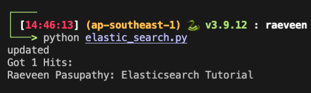

# ElasticSearch for Docker (Single Node - For Local Development Purposes)

---

## 1. Install Docker
## 2. Running ES on Docker
```
git clone git@github.com:InspectorGadget/es-docker.git . 
cd ./docker
docker-compose -p elasticstack up -d
```
## 3. Visually verify if ElasticSearch is running
## 4. Setup testing script for ElasticSearch
- Run this on the main folder of the cloned project. ('./es-docker/')
```
python3 -m venv venv
source venv/bin/activate
pip install -r requirements.txt
python elastic_search.py
```

**Output:**
